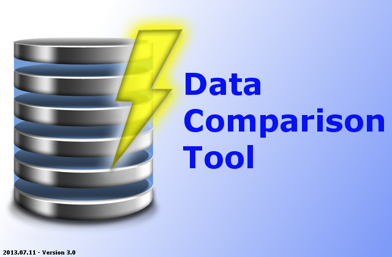

#DatabaseComparatorTool

##Supported DBMS

* Microsoft SQL Server
* Sybase

*Can be modified to supprt any database by adding specific database driver to the application

##About

This application can be used to compare data on two tables. Currently only Sybase database is supported. However by loading JDBC drivers, this application is compatible with any database server.

##How to Use

First, enter with your credentials. If credentials are valid for a server, it will display a list of databases available on the server. Select a database and click “Connect” to connect to it. You must connect to both databases you wish to compare before continuing.

Then the application will display a list of tables on the database. Select a table and fields list will be updated automatically. Select a field and enter a where condition.

Select a server or servers which you would like to scan for unique records.

Also from the list box select columns you would like to compare from tables. Click “Compare” to continue.

Ones the application finish comparing the data, it will display any disputes. You can generate SQL statements for these disputes by clicking “Generate SQL” button.
